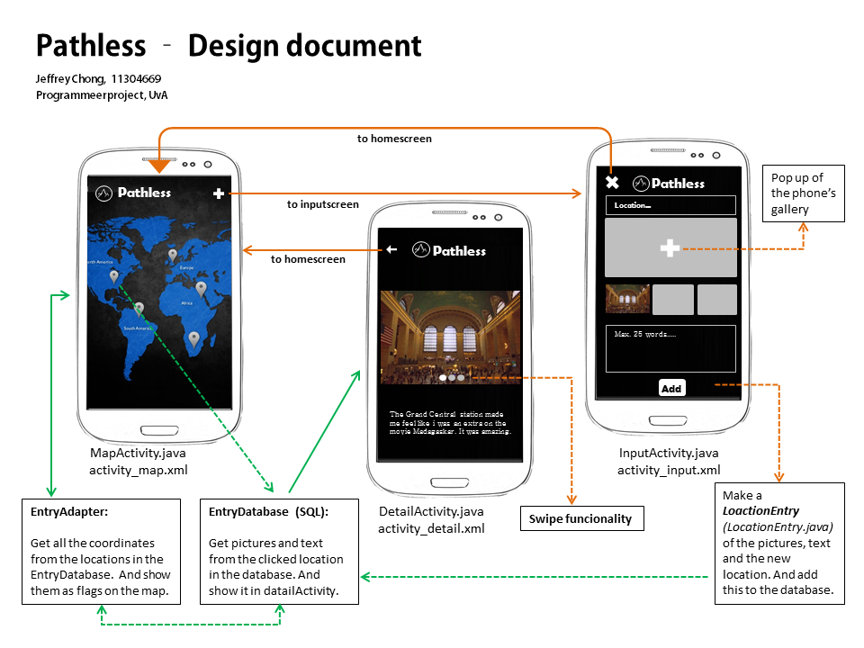

# Design document - Pathless
De volgende sketch geeft de uitgebreide UI weer van de Pathless app. 
De achterliggende connecties tussen de activities en functionaliteiten zijn hier weergegeven. 

| Class LocationEntry | Realtime Database (Firebase) |
| ------------------- | ---------------------------  |
| coordinates         | double, double               |
| pictures            | Uri                          |
| description         | text (String)                |

### API, Classes.
- Google maps API (homescreen)
- Google Places API
- ViewPager Class voor de swipe functionaliteit van de foto's (detailscreen)
