# Day 3
### Geïmplementeerd/toegevoegd:
- De drie activities met de bijbehorende xml bestanden.
- De basis google maps api. 
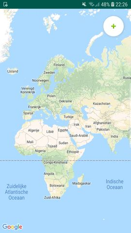

### Veranderingen of toevoegingen in het plan:
- Gekozen voor firebase (database) ipv SQL. 
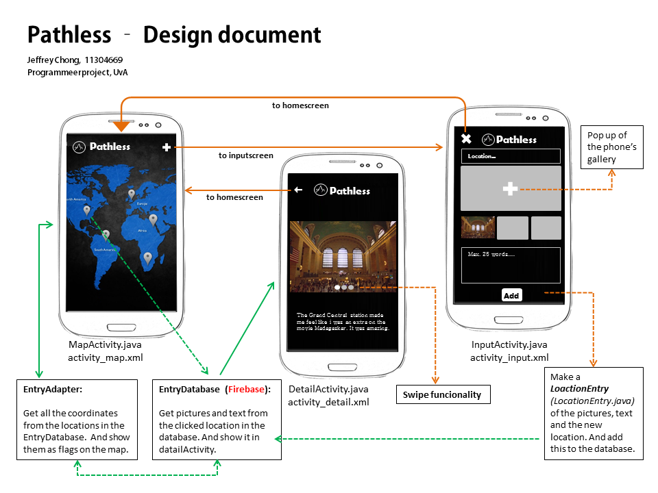

# Day 4
### Geïmplementeerd/toegevoegd:
- Schrijven van foto's en tekst naar de Firebase database. 
- Post.java class.
- Connectiviteit tussen de 3 activities. 
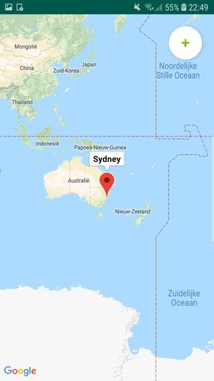
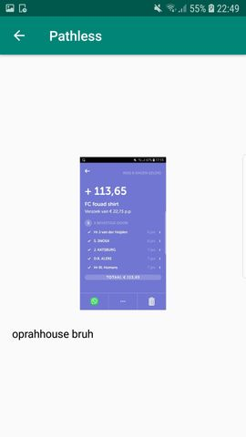
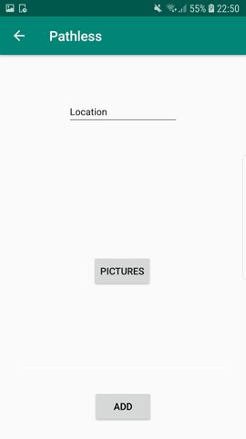
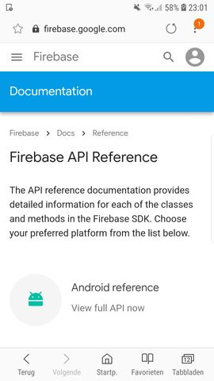

### Veranderingen of toevoegingen in het plan:
- Bitmap omzetten in String en die String opslaan in de database (nog zoekende naar betere manier). 
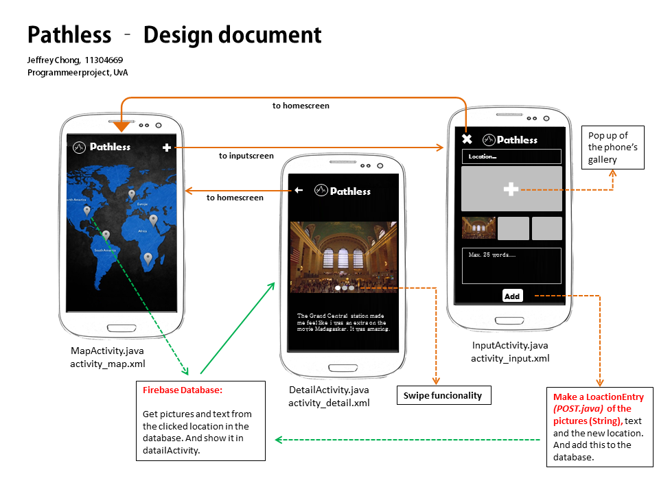

# Day 5
### Geïmplementeerd/toegevoegd:
- Het lezen van de informatie (onder de gekozen locatie) uit de Firebase database. En dit laten zien in de DetailActivity. 
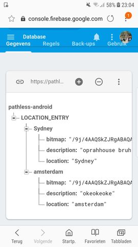

### Veranderingen of toevoegingen in het plan:
- LocationInformation.java class. 
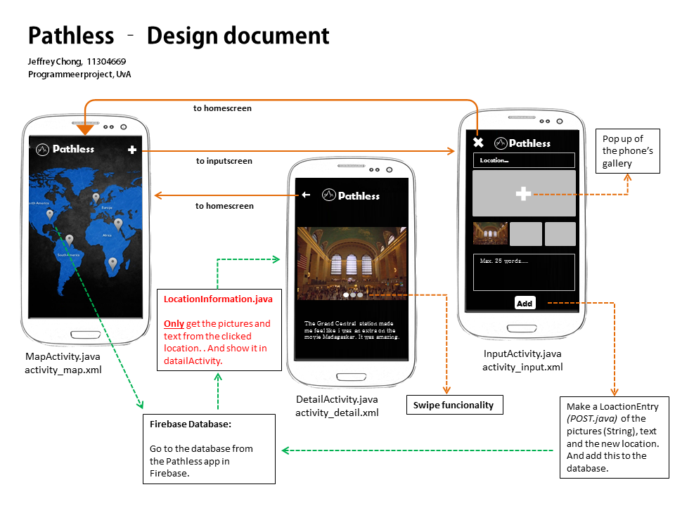

# Day 6
### Geïmplementeerd/toegevoegd:
- Authentication/userID wordt gemaakt per telefoon
- Opslaan van foto's in storage 
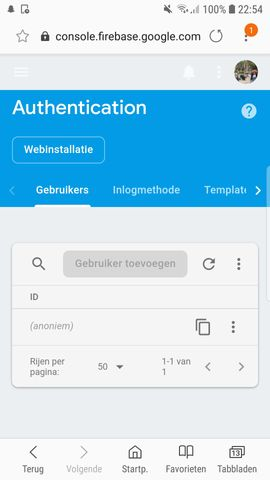

### Veranderingen of toevoegingen in het plan:
- Het gebruik van een userID
- Storage firebase naast de realtime database. 
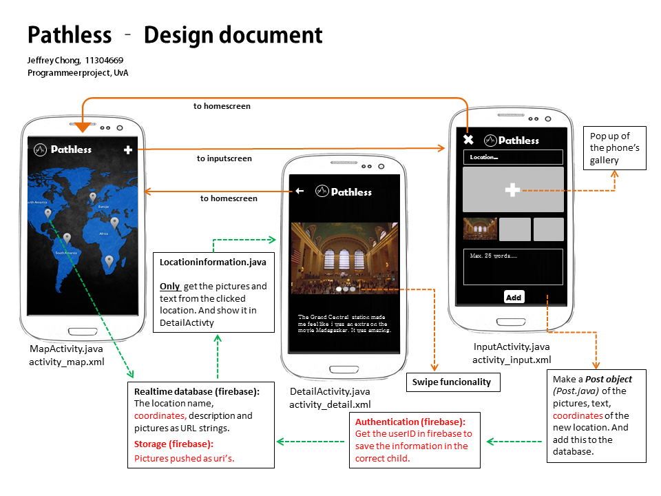

# Day 7
### Veranderingen of toevoegingen in het plan:
- Foto's uit de storage als url string opslaan in database. 

# Day 8
### Geïmplementeerd/toegevoegd:
- De url's van de images uit storage ophalen en deze in de database als een array voor een locatie opslaan.
- Een foto van een locatie ophalen uit the storage voor een locatie met glide.
- (Alpha versie) 

# Day 9
### Geïmplementeerd/toegevoegd:
- Design en logo van de app.
- Google maps autocomplete suggestion voor locaties in edit text (InputActivity).
- De latitude en longitude ophalen van een plaatsnaam. 
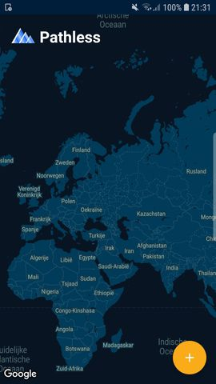
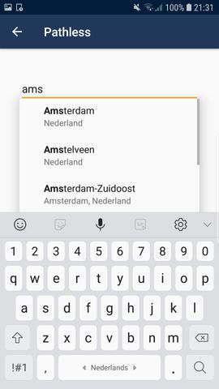
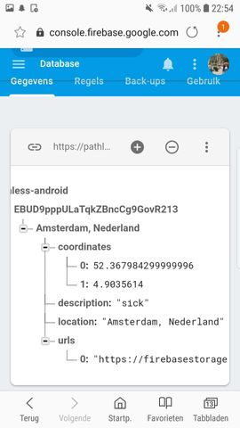

### Veranderingen of toevoegingen in het plan:
- Gebruik van autocomplete voor de locatienamen.
- De coordinaten van de plaatsen opslaan in de database. 
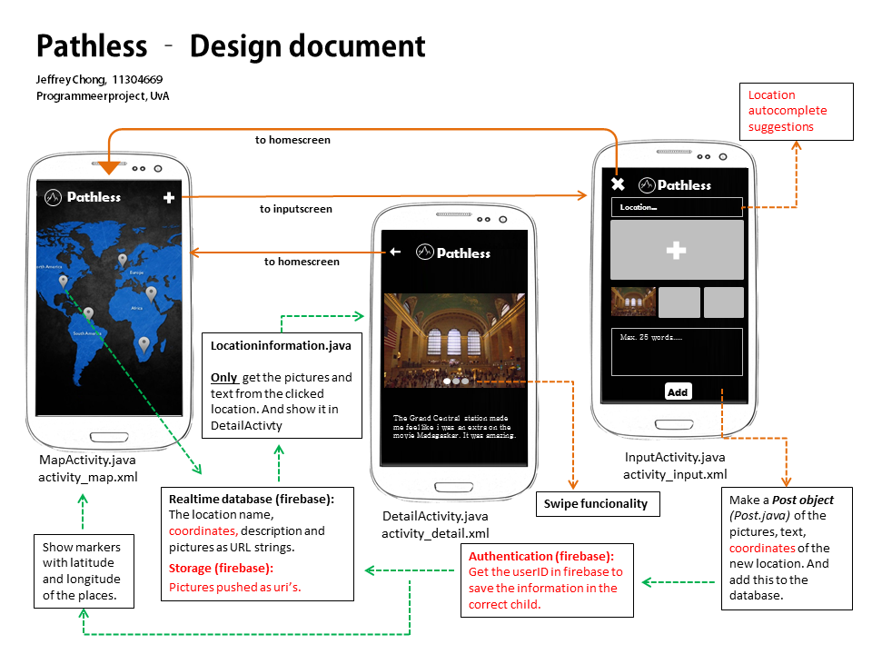

# Day 10
### Veranderingen of toevoegingen in het plan:
- een extra array in database voor elke user waarin the plaatsnamen opgeslagen zijn.

# Day 11
### Geïmplementeerd/toegevoegd:
- ophalen van de coordinaten van allee toegevoegde plekken
- marker zetten op de toegevoegde plaatsen
- imageslider

# Day 12
### Veranderingen of toevoegingen in het plan:
- landscap orientation
- buttons in de InputActivity zijn disabled als er foto's gepusht worden naar firebase en zijn weer enabled als dat klaar is.

### Veranderingen of toevoegingen in het plan:
- image slider in de InputActivity

# Day 13
### Geïmplementeerd/toegevoegd:
- een indicator in de vorm van rondjes onder het scherm die de hoeveelheid foto's aangeven in laat zijn naar de hoeveelste foto je aan het kijken bent

# Day 14
- Hackothon

# Day 15
### Veranderingen of toevoegingen in het plan:
- Design aanpassingen. 

# Day 16
### Veranderingen of toevoegingen in het plan:
- Aanpassing op het verkijgen van informatie uit firebase.
- Back buttons naar de correcte activities. 

# Day 17
### Geïmplementeerd/toegevoegd:
- Delete functie, waarbij zowel front- als back-end informatie van een locatie wordt verwijdert.
- Welkom scherm voor 3 seconde.
- Design aanpassingen in de inputActivity. Gallery button midden in het scherm en confirm button zijn rechts boven. 
