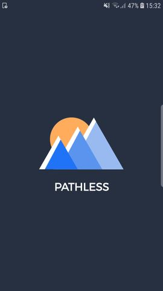
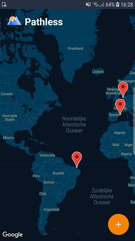
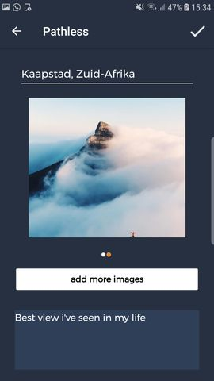
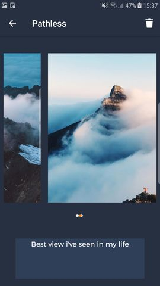

# Programmeerproject - Pathless

Name: Jeffrey Chong 
Student nmr.: 11304669 
Course: Programmeerproject (mprog), UvA 

### De Pathless app
Het ontdekken en vastleggen van plekken op de wereld spreekt veel mensen aan. 
Tijdens een reis wilt men vaak niet meer alleen naar een resort of pretpark. Maar juist het zoeken naar het mooiste uitzicht, 
het ontmoeten van de lokale bevolking en het leren van nieuwe culturen wordt bijvoorbeeld steeds belangrijker voor reizigers. 

In de Pathless app kunnen reizigers tijdens of na de reis hun favorieten locaties toevoegen aan de Pathless map. 
Vervolgens kunnen zij foto's en een aantal regels tekst bijvoegen die voor hun een verhaal verteld over die plek 
of simpelweg laat zien hoe mooi die plek is. 
Hiermee maken de gebruikers een visueel archief aan die laat zien welke onvergetelijke plekken zij gezien hebben. 

##### Link naar de product demo van de app: 
[https://vimeo.com/314547496](https://vimeo.com/314547496)

 

### Pathless app screenshots

 
  
### Credits
- JakeWharton - Een deel van de 'ViewPagerIndicator' is geïmplementeerd om een image indicator te maken in de 'DetailActivity' (regel 155) en de 'InputActivity' (regel 236). Dit is weergegeven als bolletjes onder de foto. Licensed under the Apache License, Version 2.0. 

- Google Samples - De 'PlaceCompleteAdapter' die voor een betere implementatie zorgt voor de suggesties die gegeven worden tijdens het typen van een locatie. Licensed under the Apache License, Version 2.0. 

- Sanktips (Youtube channel) - De basis van de ImageSliderAdapter is afkomstig van het Youtube kanaal Sanktips die tutorial videos maken. Het gedeelte waar Glide gebruikt wordt is eigen implementatie.

- Patrick Chong - Design van het logo van de Pathless app.
