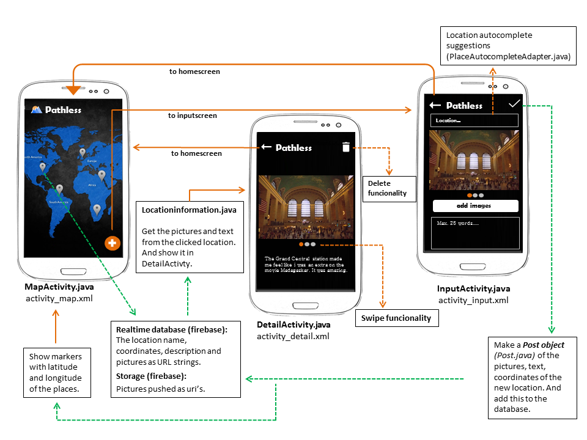

# App beschrijving

In de Pathless app kunnen reizigers hun favorieten locaties toevoegen aan de Pathless map. 
Vervolgens kunnen zij foto's en een aantal regels tekst bijvoegen. Hiermee maken de gebruikers een visueel archief aan die laat zien welke onvergetelijke plekken zij gezien hebben. 

 

# Technisch design

 

### InputActivity
De 'MapActivity' is de homescreen van de app. Door op de floating action button te klikken komt de gebruiker in de 'InputActivity' om een nieuwe locatie toe te voegen. De edit text bovenin dit scherm is geconnect aan de 'PlaceAutocompleteAdapter' (OnCreate van PlaceAutoCompleteAdapter.java), deze adapter komt van een project uit de github van Google Samples. Als er op de 'add images button' wordt geklikt, komt de gebruiker in de gallerij. Nadat er een foto is gekozen wordt deze toegevoegd aan de 'storage' in Firebase met als file naam: de current time en het laatste deel van de uri. De foto heeft dan ook een eigen url gekregen via firebase. Dit proces geldt voor elke toegevoegde foto. Op de 'add images button' is "Loading..." te zien totdat de foto succesvol is gepusht naar de Firebase storage. De Uri van de foto's worden daarnaast lokaal toegevoegd aan een array. Deze wordt gebruikt om de toegevoegde foto's in de 'InputActivity' te laten zien (showImage method in InputActivity). De 'ImageSliderAdapter' (ImageSliderAdapter.java) wordt dan geconnect aan die array met foto's. In deze adapter wordt 'Glide' gebruikt (MyAppGlideModule) om de foto's te laten zien in de slider, zodat de gebruiker door de foto's kan swipen. Ook wordt de viewPager geconnect aan de 'CirclePagerIndicator'. Dit zorgt voor de bolletjes onder de foto die aangeven hoeveel foto's er te zien zijn. Dan kan er nog een stuk tekst tegoevoegd worden. Als er vervolgens op de 'check button' geklikt is, wordt de locatienaam, description, coordinaten en foto's (als URL's in een array) samengevoegd in een 'Post object' (Post.java) en daarna toegevoegd in de Firebase database onder de user id van de telefoon. De gebruiker krijgt daarna weer de 'MapActivity' te zien.
 

### MapActivity
Tijdens het laden van de map, worden de coordinaten van elke toegevoegde locatie èèn voor èèn opgevraagd. De 'latitude' en 'longitude' worden dan als 'LatLng' type samen met de locatie naam meegegeven om een markerInformation object te maken (MarkerInformation.java). De marker wordt dan met behulp van de LatLng toegevoegd aan de map. Tegelijkertijd wordt de locatienaam als title toegevoegd, deze is dan in de 'info window' weergegeven. In de 'OnCreate' krijgen de info windows van de markers een 'onClickListener' naar de 'DetailActivity' en de floating action button naar de 'InputActivity'. 
 

### DetailActivity
Als er op èèn van de markers geklikt wordt, komt er een 'info window' te voorschijn aan de marker en wordt het scherm een stuk ingezoomd op de locatie. De info window geeft de locatienaam als extra string mee aan de intent naar de 'DetailActivity'. Hier wordt die locatienaam gebruikt om te navigeren naar de Firebase database. De gehele child (node) van die locatie wordt dan geselecteerd. De locatienaam, description en array met url's maken samen een 'LocationInformation' object aan (LocationInformation.java). Net zoals in de 'InputActivity' wordt dan de image slider en indicator geconnect, voor een fijne user experience. De description wordt dan opgehaald en  laten zien in een textbox. Ten slotte is er functie om de locatie te verwijderen. Als de gebruiker op de prullenbak klikt, komt er een pop up te voorschijn waarin staat of de gebruiker zeker is van zijn/haar keuze. Als 'delete'gekozen is wordt de hele node van de locatie  met behulp van de user id en locatienaam verwijdert van de Firebase database.

 

# Uitdagingen en belangrijke aanpassingen
De grootste uitdagingen en aanpassingen aan het initiële plan van de app zijn Firebase gerelateerd. In dag twee kreeg ik te horen dat Firebase een goede optie is om data online op te slaan. En in dag drie had ik besloten om deze database te gebruiken in plaats van SQLite. De reden van deze keuze is beschreven in het volgende hoofdstuk. Tijdens het proces werd het al snel duidelijk dat de data van een toegevoegde locatie als een pakket, in dit geval een object, meegegeven moest worden naar de realtime database. Hierdoor stond de data van een locatie onder de 'tak' van die locatienaam en was het duidelijk welke data bij elkaar hoorden. In het begin was het plan om de foto als bitmap te hashen met behulp van een hash functie en de verkregen key op te slaan in de realtime database. Dit zorgde voor problemen omdat het lang duurde totdat de key weer werd teruggezet naar de bitmap en vice versa. Ook stond de foto zelf officieel niet online. Er is daarom gekozen om elke toegevoegde foto naar de 'storage' van firebase te pushen met een unieke file naam. Hiermee kreeg elke foto een eigen url link van firebase en stond de foto dus online. Deze url kon daardoor ook als string opgeslagen worden in de 'realtime database' onder de juiste locatienaam. Hiermee kon voor elke locatie efficiënt de juiste fotos opgehaald worden. 
Er is ook gebruik gemaakt van de 'authentication' van Firebase, zodat een eventuele vrienden systeem in de toekomst mogelijk zou zijn. Dit is dan uiteindelijk niet gelukt om het binnen dit vak te implementeren, maar het is wel mogelijk om de app op meerdere telefoons te zetten waarbij ieder zijn/haar eigen map en markers heeft. 

In de InputActivity werd het duidelijk dat het enige tijd duurde voordat de foto's uit de gallerij overgezt konden worden naar Firebase. Dit zorgde vaak voor race conditions. Daarom is er vaak gebruik gemaakt van 'OnCompleteListeners' en if-loops, zodat bijvoorbeeld een foto eerst succesvol gepusht moest worden naar firebase voordat een ander proces mocht beginnen.
