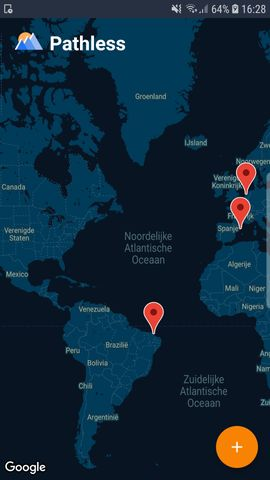

# App report description

In de Pathless app kunnen reizigers hun favorieten locaties toevoegen aan de Pathless map. 
Vervolgens kunnen zij foto's en een aantal regels tekst bijvoegen. Hiermee maken de gebruikers een visueel archief aan die laat zien welke onvergetelijke plekken zij gezien hebben. 

 

# Technical design

 

### InputActivity
De 'MapActivity' is de homescreen van de app. Door op de floating action button te klikken komt de gebruiker in de 'InputActivity' om een nieuwe locatie toe te voegen. De edit text bovenin dit scherm is geconnect aan de 'PlaceAutocompleteAdapter' (OnCreate van PlaceAutoCompleteAdapter.java), deze adapter komt van een project uit de github van Google Samples. Als er op de 'add images button' wordt geklikt, komt de gebruiker in de gallerij. Nadat er een foto is gekozen wordt deze toegevoegd aan de 'storage' in Firebase met als file naam: de current time en het laatste deel van de uri. De foto heeft dan ook een eigen url gekregen via firebase. Dit proces geldt voor elke toegevoegde foto. Op de 'add images button' is "Loading..." te zien totdat de foto succesvol is gepusht naar de Firebase storage. De Uri van de foto's worden daarnaast lokaal toegevoegd aan een array. Deze wordt gebruikt om de toegevoegde foto's in de 'InputActivity' te laten zien (showImage method in InputActivity). De 'ImageSliderAdapter' (ImageSliderAdapter.java) wordt dan geconnect aan die array met foto's. In deze adapter wordt 'Glide' gebruikt (MyAppGlideModule) om de foto's te laten zien in de slider, zodat de gebruiker door de foto's kan swipen. Ook wordt de viewPager geconnect aan de 'CirclePagerIndicator'. Dit zorgt voor de bolletjes onder de foto die aangeven hoeveel foto's er te zien zijn. Dan kan er nog een stuk tekst tegoevoegd worden. Als er vervolgens op de 'check button' geklikt is, wordt de locatienaam, description, coordinaten en foto's (als URL in een array) samengevoegd in een 'Post object' (Post.java) en daarna toegevoegd in de Firebase database onder de user id van de telefoon. De gebruiker krijgt daarna weer de 'MapActivity' te zien.
 

### MapActivity
Tijdens het laden van de map, worden de coordinaten van elke toegevoegde locatie èèn voor èèn opgevraagd. De 'latitude' en 'longitude' worden dan als 'LatLng' type samen met de locatie naam meegegeven om een markerInformation object te maken (MarkerInformation.java). De marker wordt dan met behulp van de LatLng toegevoegd aan de map. Tegelijkertijd wordt de locatienaam als title toegevoegd, deze is dan in de 'info window' weergegeven. In de 'OnCreate' krijgen de info windows van de markers een 'onClickListener' naar de 'DetailActivity' en de floating action button naar de 'InputActivity'. 
 

### DetailActivity
Als er op èèn van de marker geklikt wordt, komt er een 'info window' te voorschijn aan de marker en wordt het scherm een stuk ingezoomd op de locatie. De info window geeft de locatienaam als extra string mee aan de intent naar de 'DetailActivity'. Hier wordt die locatienaam gebruikt om te navigeren naar de Firebase database. De gehele child (node) van die locatie wordt dan geselecteerd. De locatienaam, description en array met url's maken samen een 'LocationInformation' object aan (LocationInformation.java). Net zoals in de 'InputActivity' wordt dan de image slider en indicator geconnect, voor een fijne user experience. De descirption wordt dan opgehaald en  laten zien in een textbox. Ten slotte is er functie om de locatie te verwijderen. Als de gebruiker op de prullenbak klikt, komt er een pop up te voorschijn waarin staat of de gebruiker zeker is van zijn/haar keuze. De hele node van de locatie wordt dan met behulp van de user id en locatienaam verwijdert van de Firebase database.
 
